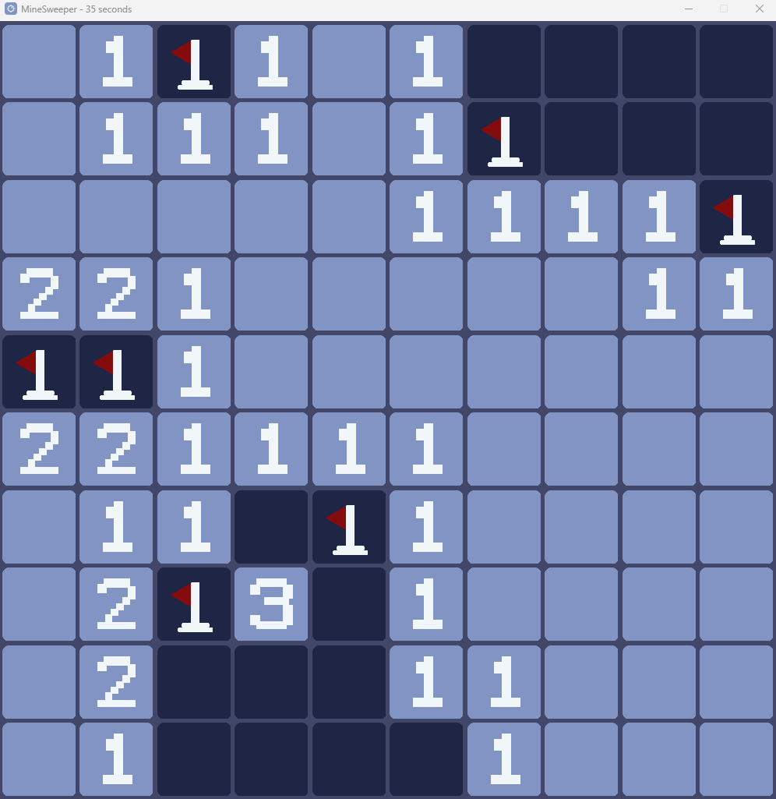
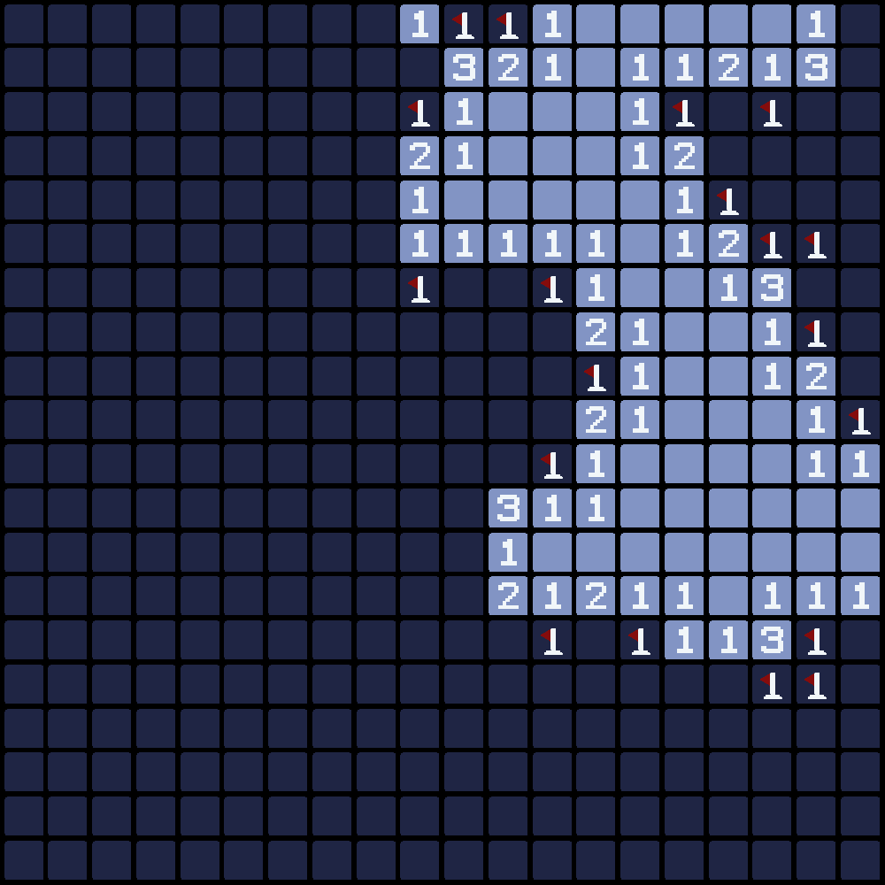
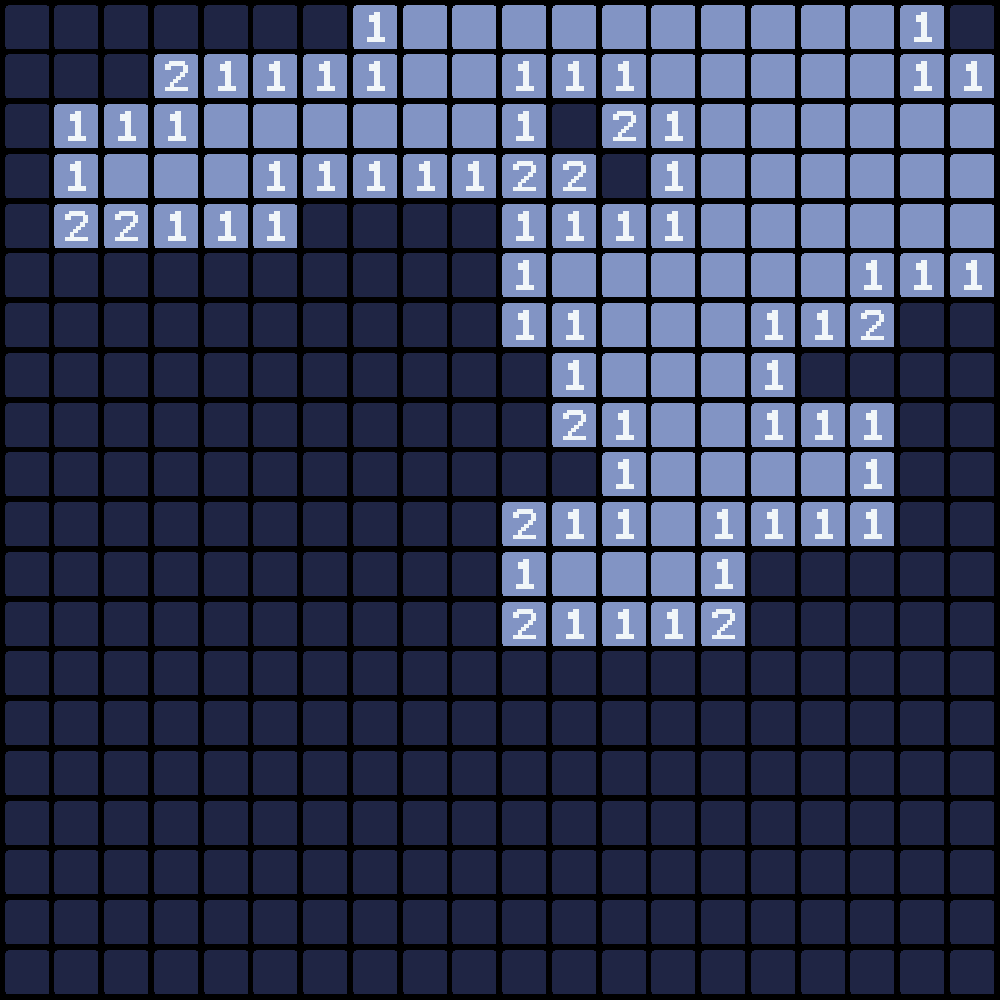

# Minesweeper-AI

MineSweeper AI est un projet qui a pour but de créer une intelligence artificielle capable de jouer au jeu. Le modèle utilisé est un réseau de neurones convolutif (CNN) qui prend en entrée une image de la grille de jeu et renvoie une image de la même taille avec une prediction pour chaque case adjacente aux cases déjà découvertes.

Le projet comprend les éléments suivants:

- Un jeu jouable par un humain grâce à une interface graphique
- Une intelligence artificielle capable de jouer au jeu
- Un algorithm basé sur des règles pour comparer les performances de l'IA
- La possibilité d'enregistrer une partie et créer un gif de celle-ci
- des fichiers de configuration pour modifier les paramètres du jeu et de l'IA

## Quelques aperçus du jeu

### Partie 10x10


### Rules based AI


### CNN Neural Network AI



## Installation

Ce projet a été réalisé avec Python 3.10.0 et il est recommandé d'utiliser un environnement virtuel pour installer les dépendances.

1. Cloner le projet et accéder au répertoire :

```bash
- git clone https://github.com/hugo-hamon/Minesweeper-AI.git
- cd Minesweeper-AI
```

2. Créez un environnement virtuel et l'activer :
    
- Sous linux et macOS :
```bash
python3 -m venv venv
source venv/bin/activate
```
- Sous Windows :
```bash
python3 -m venv venv
.\venv\Scripts\activate
```

3. Installez les dépendances nécessaires à l'aide de `requirements.txt` :
```bash
pip install -r requirements.txt
```

## Utilisation

Pour lancer le jeu, exécutez le fichier `run.py` :

```bash
cd project
python run.py
```

## Configuration

Le dossier `config` contient différents fichiers de configuration déja prêts, mais vous pouvez en créer de nouveaux ou modifier ceux existants.

## Crédits

Ce projet a été réalisé par `Hugo Hamon`

## License

Ce projet est sous licence MIT - voir le fichier [LICENSE](LICENSE) pour plus de détails
